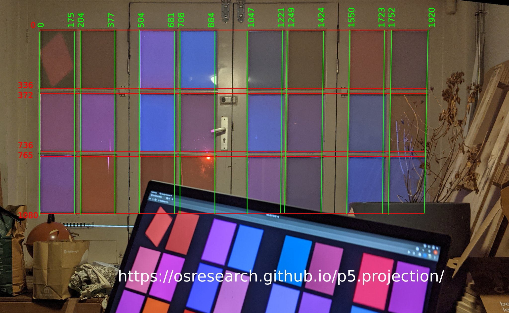

To add a sketch to the cycle, create `foo.js` with:

```
sketches.push(function(){

// setup code goes here
let t = 0;

// drawing code goes here
return function(){
	background(0);
	stroke(t,0,256-t);
	line(0,0,t,1080);
	t = (t + 1) % 1920;
}});
```

And then add it to the `index.html` with the others:
```
  <script language="javascript" type="text/javascript" src="foo.js"></script>
```

Test it by serving it from your local machine:

```
python3 -m http.server
```

And then open http://localhost:8000/presentation.html in your browser.
Press `1` to cycle through the other pieces until your new one is reached.

Once it looks good, send a pull request for your changes!

The drawing canvas that is provided to your sketch is 1920x1080
and is a normal 2D renderer.



The boundaries for the door frames are:

```
let x_cords [0, 204, 504, 708, 1047, 1249, 1550, 1752];
let y_coords = [0, 372, 745];
```

The windows are roughly all the same size:

```
let rect_w = 175;
let rect_h = 336;
```


TODO: fixup the QR codes assignment; move them into the draw functions?
